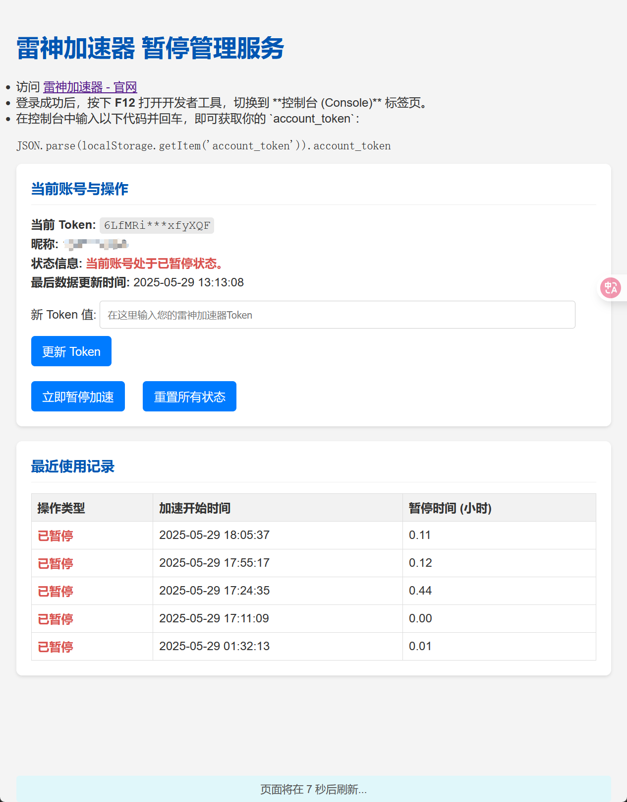
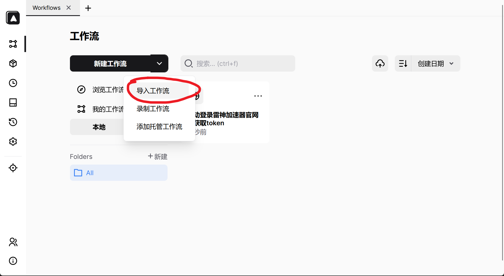
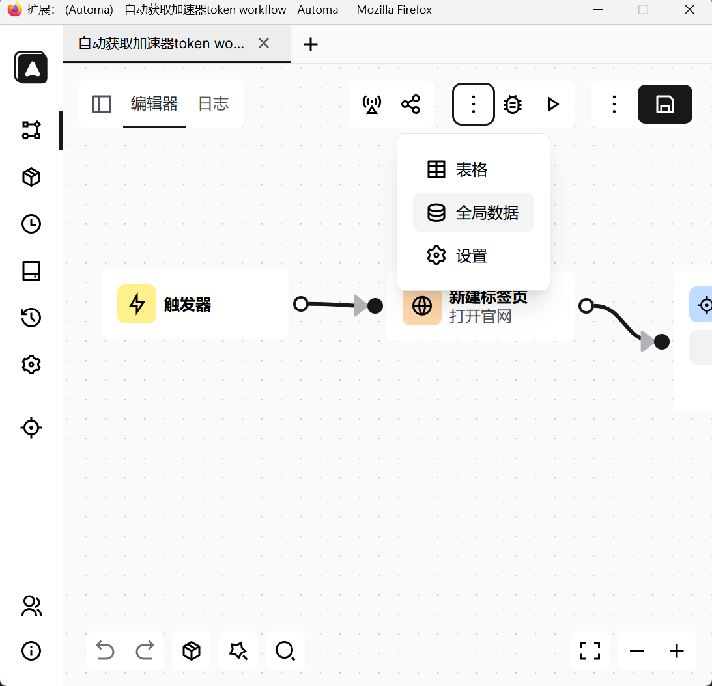

# 前言

前段时间玩游戏没注意暂停，怒失200游戏时长，一怒之下写了这个工具, 推荐有服务器的人使用（因为需要24h运行
当前方案是输入token，然后监听, 代码基于gemini生成的，然后简单处理了一下，请求api地址和方法参照了 [6yy66yy/legod-auto-pause](https://github.com/6yy66yy/legod-auto-pause)

## 雷神加速器暂停管理服务

一个基于 FastAPI 的小型服务，用于管理雷神加速器的账号暂停状态，并支持自动暂停功能。

## 功能特性

* **账号信息展示**: 显示当前 Token 对应的昵称和账号状态。
* **一键暂停**: 手动触发暂停加速操作。
* **使用记录**: 展示最近的加速和暂停明细，包括每次加速的时长。
* **自动暂停**: 当检测到账号处于加速状态超过设定阈值时（默认为12小时）发送通知，大于24小时时尝试自动暂停加速。
* **Server酱通知**: 集成 Server酱，可在加速时长超过阈值时发送通知。

## 快速开始 (使用 Docker)

下面有automa脚本可以快速获取token然后更新到本服务(滑动验证还在研究)

### 使用 Docker 命令直接运行 (推荐)

```cmd
docker run -d \
  --name leigod-auto-pause-service \
  -p 8000:8000 \
  -e token="YOUR_LEIGOD_TOKEN_HERE" \
  -e serverchan_sendkey="YOUR_SERVERCHAN_SENDKEY_HERE" \
  --restart always \
  yuanzhangzcc/leigod-auto-pause
```

**请注意**:

* 将 `YOUR_LEIGOD_TOKEN_HERE` 替换为你的实际 Token。如果不需要，可以将这行删除。
* 将 `YOUR_SERVERCHAN_SENDKEY_HERE` 替换为你的 Server酱 SendKey。如果不需要，可以将这行删除。

#### 使用 Docker Compose 运行

首先，确保你的项目根目录下有 `docker-compose.yml` 文件：

```yaml
version: '3.8'

services:
  leigod-auto-pause:
    image: yuanzhangzcc/leigod-auto-pause
    container_name: leigod-auto-pause-service
    ports:
      - "8000:8000"
    environment:
      # 将 YOUR_LEIGOD_TOKEN_HERE 替换为你的实际 Token
      - token="YOUR_LEIGOD_TOKEN_HERE" 
      # 将 YOUR_SERVERCHAN_SENDKEY_HERE 替换为你的 Server酱 SendKey (可选)
      - serverchan_sendkey="YOUR_SERVERCHAN_SENDKEY_HERE" 
    restart: always
```

然后运行：

```cmd
docker-compose up -d
```

### 2. 访问服务

在浏览器中访问 `http://localhost:8000` (如果部署在其他服务器，请替换为服务器IP)。

## 本地运行

```bash
git clone https://github.com/QuietBlade/leigod-auto-pause.git
cd leigod-auto-pause
```

### 2. 配置环境变量

这两个环境变量（`token` 和 `serverchan_sendkey`）都不是必须的，设置 `token` 初始化用户信息，设置 `serverchan_sendkey` 启用微信通知。

```ini
# .env 文件示例 (推荐使用此文件来管理环境变量)
# token="你的雷神加速器账号Token"
# serverchan_sendkey="你的Server酱SendKey (可选，用于微信通知)"
```

**如何获取 Token**:

1. 访问 [雷神加速器官网](https://www.leigod.com/) 并登录。
2. 登录成功后，按下 **F12** 打开浏览器开发者工具，切换到 **控制台 (Console)** 标签页。
3. 在控制台中输入以下代码并回车，即可获取你的 `account_token`：

    ```javascript
    JSON.parse(localStorage.getItem('account_token')).account_token
    ```

**如何获取 Server酱 SendKey**:
访问 [Server酱官网](https://sct.ftqq.com/) 注册并获取 SendKey。

### 3. 本地运行

```bash
python main.py
```

### 构建本地镜像 Docker 镜像

```bash
docker build -t leigod-auto-pause .
docker run -d \
  --name leigod-auto-pause-service \
  -p 8000:8000 \
  -e token="YOUR_LEIGOD_TOKEN_HERE" \
  -e serverchan_sendkey="YOUR_SERVERCHAN_SENDKEY_HERE" \
  --restart always \
  leigod-auto-pause
```

## 运行图片



## 其他相关

### 搭配 automa 使用可以自动发送token，但是需要手动滑动验证器

[AutomaApp/automa](https://github.com/AutomaApp/automa)

1. 下载插件 [Chrome Web Store](https://chrome.google.com/webstore/detail/automa/infppggnoaenmfagbfknfkancpbljcca) / [Firefox Add-ons](https://addons.mozilla.org/en-US/firefox/addon/automa/)

2. 下载 `./自动获取加速器token.automa.json` 文件

3. 插件中导入


4. 编辑全局变量用于登录和token更新


5. 填写内容为自己的
```json
{
  "phone": "",
  "password": "",
  "api_url": "http://localhost.com:8000/update-token"
}
```

6. 然后执行后滑动验证码即可

## 贡献

欢迎提交 Pull Request 或 Issues 来改进项目！

## 许可证

本项目基于 MIT 许可证开源。
